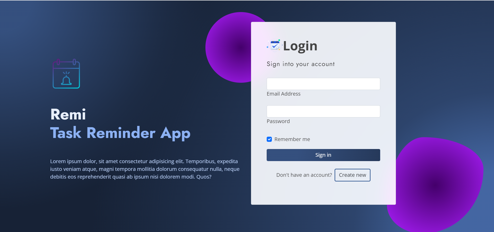
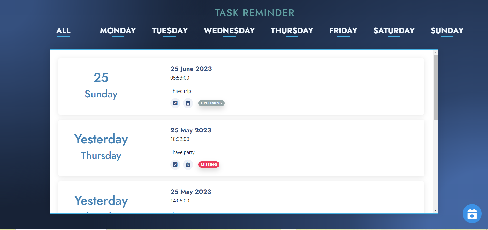
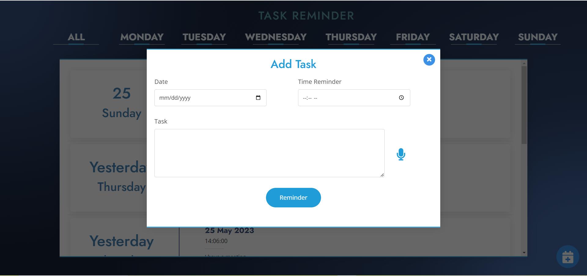

# *About* ❓
**This is Task Reminder Voice App**.

 * Presentation link : https://drive.google.com/file/d/1pp-ZeClLUiBlft1xwJLgXGEvvTnbJbBk/view?usp=sharing

Also this is the Machine Learning project.

<h3 align="center"></h3>

# *Introduction* 📝
This app outlines the development of a Task Reminder Voice App, designed
to assist users in managing their daily tasks and to-do lists and remind them
using voice commands. The app will utilize natural language processing and
machine learning algorithms to understand and interpret user commands
accurately, ensuring a seamless and efficient user experience. The app will
also feature customizable reminder settings, allowing users to set reminders
for specific tasks or events at designated times. The Task Reminder Voice
App aims to provide a practical solution for busy individuals looking to
streamline their daily workflow.

# *Role* ✒
* User - Persons who want to set reminders for their tasks.

# *System Requirements* 📞
* User Should be able to:
  1. Register as a user system.
  2. Log into the system using their email and password.
  3. Ability to create/update/delete tasks, set due dates
  4. Ability to track task status
  5. User can get automated reminders
      
# *Details* 🔖
Below you can see the languages,frameworks architectures, tools I used  the project. 

## Technologies
* HTML
* CSS
* Java Script
* Python
* MySQL
* Machine Learning
  * Natural Language Processing
  * Voice Recognition

## Frameworks

* Bootstrap
* Flask

## Tools

* IntelliJ IDEA
* VS Code
* WinSCP

## Other

* AWS

